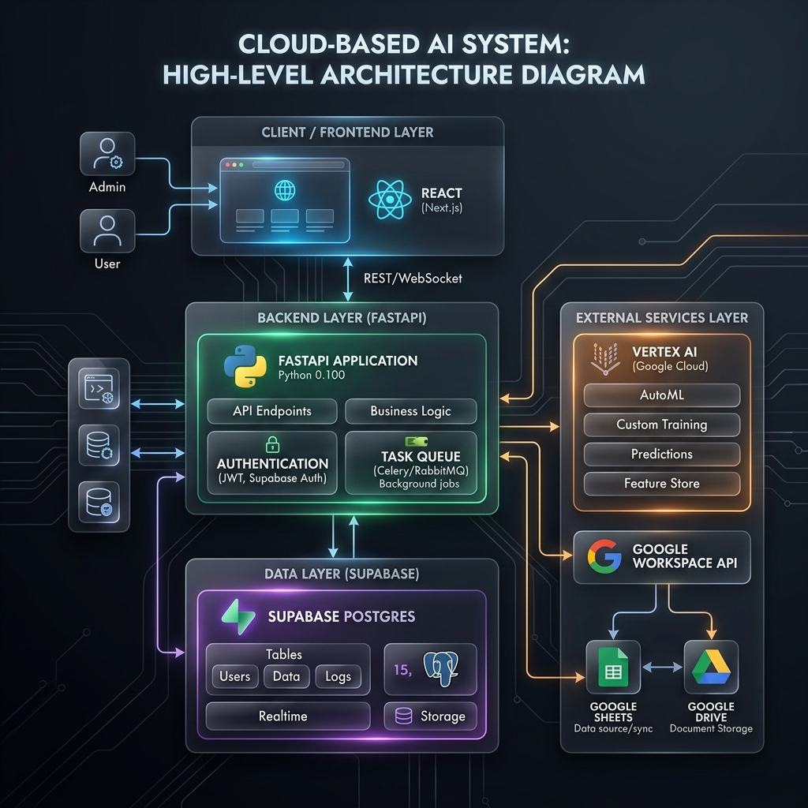

# 🎓 Answer Key Evaluation DEP (Data Evaluation Platform)


## 🌟 Overview

**Answer Key Evaluation DEP** is a state-of-the-art, high-performance automated assessment platform designed to revolutionize the grading process in educational institutions. By leveraging advanced **LLM-driven OCR**, **multi-region cloud infrastructure**, and **automated code execution**, the system provides professors and teaching assistants with a seamless, end-to-end workflow for evaluating student submissions—from handwritten objective sheets to complex C programming code.

---

## 🏗️ Deep-Dive Architecture

The system is built on a modular, scalable architecture designed for high availability and throughput.



### 1. **Frontend Layer (React 18)**
- **Dashboard**: Real-time analytics and course management.
- **Kanban Engine**: Powered by `react-beautiful-dnd` for fluid task management.
- **Data Viz**: Integrated `Recharts` for interactive grade distribution and performance tracking.
- **Auth**: Fully integrated with Supabase Auth for secure session management.

### 2. **Backend Layer (FastAPI)**
- **Asynchronous Core**: Built on Python's `asyncio` for non-blocking I/O operations.
- **Multi-Region Load Balancer**: Distributes OCR requests across 4 global regions (US-Central, US-East, US-West, EU-West) to maximize throughput.
- **Lifespan Management**: Handles startup connection pooling for Supabase and Vertex AI, and ensures clean resource disposal on shutdown.

### 3. **Data Layer (Supabase & SQLite)**
- **Primary DB**: Supabase (Postgres) for global state, user profiles, and course data.
- **Intelligent Cache**: Dual-backend support (SQLite/Postgres). Uses **SHA-256 file hashing** to skip reprocessing of identical submissions.

---

## 🔍 The OCR Intelligence Engine

Our OCR pipeline is not just about text extraction; it's about **contextual understanding** and **pre-processing excellence**.

### **Advanced Image Pre-Processing**
Before reaching the LLM, every image undergoes an intelligent cleanup via the `ImagePreprocessingService`:
- **Paper Isolation**: Uses **OpenCV HSV color thresholding** to detect the largest white-paper region, effectively cropping out dark scanner lids or shadows.
- **Morphological Cleanup**: Applies morphological "close" operations to fill in holes caused by printed text, ensuring a solid paper mask.
- **Adaptive Compression**: Resizes and compresses images (LANCZOS resampling) to optimize bandwidth while preserving text clarity.

### **Smart Matching System (5-Stage Workflow)**
The `SheetsService` implements a sophisticated matching algorithm to correlate OCR'd data with master rosters:
- **Stage 1 (Exact)**: Matches corrected entry numbers (e.g., `2023CSB1122`).
- **Stage 2 (Year-Sliding)**: Detects roll number matches where the year might be misread (±3 years).
- **Stage 3 (Levenshtein)**: Employs fuzzy matching with **OCR-aware substitution costs** (e.g., lower penalty for `5` vs `S`).
- **Stage 4 (Structural)**: Uses domain knowledge to fix common OCR errors in department codes (CS, MC, EE, AI).
- **Stage 5 (Dominant Name)**: Falls back to character bigram similarity if the entry number is illegible.

---

## 💻 Automated C Code Evaluator

A specialized module for technical assessments that takes handwriting all the way to binary execution.

- **Handwritten to Executable**: Extracts handwritten C code snippets and converts them into valid source code using Gemini Pro.
- **Competitive Programming (LeetCode) Mode**: 
    - **Problem Parsing**: Maps extracted logic to specific algorithmic problem structures.
    - **Test-Driven Evaluation**: Runs student code against comprehensive `stdin`/`stdout` test cases.
    - **Diff Analysis**: Provides granular feedback on exactly where the output diverged from the expected result.
- **Sandboxed Execution**: Compiles and executes code in a secure, isolated environment using standard GCC tools.

---

## 📂 Automated Drive & Sheet Management

### **Intelligent File Renaming**
The `DriveRenameService` automatically organizes student submissions on Google Drive:
- **Confident Match**: `{EntryNumber} - {Name}.jpg`
- **Fuzzy Match**: `FUZZY - {EntryNumber} - {Name}.jpg`
- **Unmatched**: `UNMATCHED - OCR {OCREntry} - OCR {OCRName}.jpg`
- **Duplicate Handling**: Automatically appends `(DUP1)`, `(DUP2)` to prevent collisions.

### **Google Sheets Integration**
- **Auto-Sync**: Automatically pushes grades, comments, and per-question marks to a designated Sheet.
- **Header Auto-Detection**: Uses alias matching (e.g., `roll no` ↔ `entry number`) to work with varied sheet templates.

---

## 💻 Environment & Prerequisites

To run this platform successfully, ensure your environment meets the following specifications:

### **Supported Operating Systems**
- **macOS**: 12.0 (Monterey) or newer (Apple Silicon supported).
- **Linux**: Ubuntu 20.04 LTS / 22.04 LTS or equivalent (Recommended for production).
- **Windows**: Windows 10/11 via **WSL2 (Ubuntu)** is highly recommended. Native Windows is supported but requires manual configuration of GCC.

### **Required Software & Runtimes**
- **Python 3.10+**: Core backend runtime.
- **Node.js 18.x+**: Frontend build and runtime (Vite).
- **GCC (GNU Compiler Collection)**: Essential for the `c_code_evaluator` to compile handwritten student code.
- **OpenCV Dependencies**: `libgl1` and `libglib2.0-0` (automatically handled on macOS; may need `apt-get` on Linux).

### **Cloud & Third-Party Services**
- **Google Cloud Platform**:
    - **APIs**: Vertex AI (Gemini), Google Drive API, Google Sheets API.
    - **Auth**: Service Account JSON key with `Editor` or specific service roles.
- **Supabase**:
    - Required for user authentication and remote database caching (`CACHE_BACKEND=supabase`).
    - Postgres Connection Pooler (Transaction mode) is recommended for high-concurrency OCR runs.

---

## ⚙️ Installation & Setup

### 1. Prerequisites
Ensure you have the hardware and software listed in the [Environment](#-environment--prerequisites) section.

### 2. Backend Setup
```bash
cd backend
python -m venv venv
source venv/bin/activate  # On Windows: venv\Scripts\activate
pip install -r requirements.txt
cp .env.example .env
# Configure your .env with Vertex AI and Supabase keys
uvicorn main:app --reload
```

### 3. Frontend Setup
```bash
cd frontend-new-design
npm install
npm start
```

---

## 🛠️ Development & Testing

### **Database Schema**
If using Supabase, ensure the following tables are initialized in your project:
- `result_cache`: Stores SHA-256 hashed OCR and evaluation results.
- `pdf_page_map`: Maps multi-page PDF student submissions to their respective processing states.
- `evaluations`: Stores metadata for individual assessment runs.

### **Validation & Smoke Tests**
To ensure the system is correctly configured, you can run the built-in smoke tests:
```bash
cd backend
python smoke_test.py
```
This validates connectivity to Google Cloud, Supabase, and local database services.

---

## ⚙️ Configuration & High Performance

### **Performance Benchmarks**
| Metric | Achievement |
| :--- | :--- |
| **Max Practical RPS** | **505+ Requests / Second** |
| **Concurrency Limit** | 1,200+ parallel threads |
| **Average Latency** | 1.8s - 2.2s per sheet |
| **Fault Tolerance** | Automatic failover across 4 global regions |

### **Environment Variables (`.env`)**
- `CACHE_BACKEND`: Switch between `sqlite` (local) and `supabase` (cloud).
- `PIPELINE_MAX_CONCURRENT`: Controls internal semaphore for batching (default: `12`).
- `CORS_ORIGINS`: Comma-separated list of allowed origins.

---

## 🛠️ Security & Reliability

- **CORS Management**: Intelligent middleware that handles development and production origins securely.
- **Token-Based Auth**: Leverages Supabase JWTs for stateless backend verification.
- **Connection Pooling**: Uses `asyncpg` pools for Postgres and `TCPConnector` pools for multi-region OCR.
- **Health Monitoring**: Real-time health checks on each OCR endpoint via `/api/batch/health`.

---

## 📂 Project Structure

```text
├── backend/                # FastAPI Application
│   ├── api/                # REST Endpoints (Standard, Batch, Code-Eval)
│   ├── services/           # OCR, Evaluation, Sheets, Drive, Image-Preprocessing
│   ├── models.py           # Pydantic Schemas & Data Models
│   └── database.py         # DB Connectors (Postgres/SQLite)
├── frontend-new-design/    # React Application
│   ├── src/pages/          # Analytical Dashboards, Kanban, Team Mgmt
│   ├── src/services/       # API Clients & Interceptors
│   └── src/context/        # Global State (Auth, Real-time)
├── c_code_evaluator/       # C Code OCR & Sandbox Execution
├── sa-keys/                # (Private) Service Account JSON Keys per region
└── images/                 # Project Assets & Diagrams
```

---

## 🗺️ Roadmap & Future Vision

- [ ] **Mobile Scanning App**: Native iOS/Android app for on-the-spot sheet digitizing.
- [ ] **Advanced Plagiarism Suite**: Analyzing handwriting and code logic patterns.
- [ ] **LLM Feedback Loops**: Allowing TAs to "chat" with AI results to refine scores.
- [ ] **Enterprise SSO**: SAML and Active Directory integration for universities.

---

## 🤝 Contribution & License

We welcome contributions! Please see our `CONTRIBUTING.md` for guidelines. This project is licensed under the MIT License.
